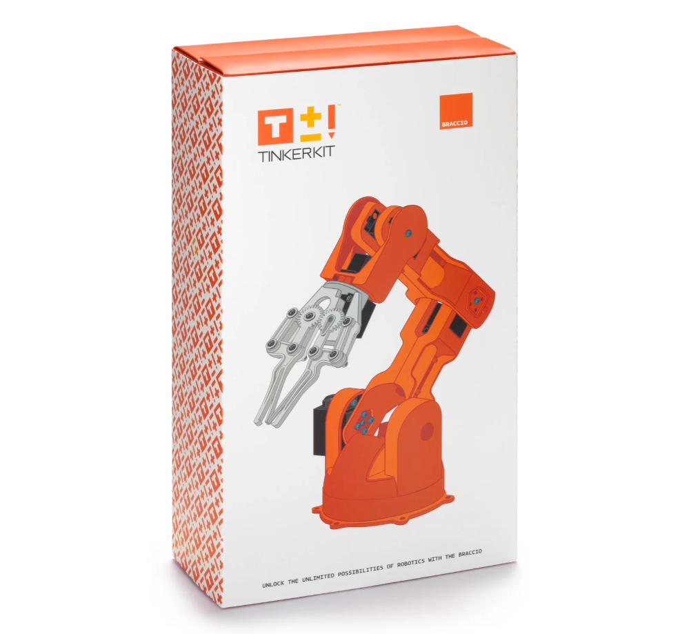
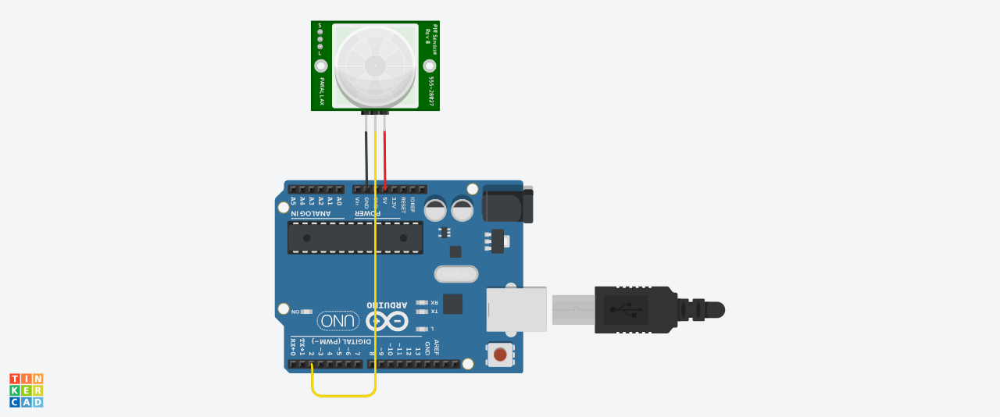

# TinkerKit-s-Braccio-Robotarm
Dette repository er en guide til hvordan du bruger TinkerKit Braccio, som er en programmérbar robotarm, der kan styres via en arduino. I dette eksempel er robotarmen forbundet til en PIR sensor, som registrerer enhver bevægelse inden for 6 meter (du kan læse mere om hvordan en PIR sensor fungerer [her](https://github.com/DDlabAU/infrared-kommunikation/blob/master/PIR_Sensor.md). Hvis PIR sensoren registrerer en bevægelser, sender den et signal til arduino’en om, at armen skal vinke. 



## Table of Contents
- [Getting Started](#getting_started)
- [Forbind PIR sensoren til arduino’en](#Forbind_PIR_sensoren_til_arduino’en)
- [Download Braccio biblioteket](#Download_braccio_biblioteket)
- [Få TinkerKit Braccio til at vinke](#Få_TinkerKit_Braccio_til_at_vinke)
- [Brugsanvisning](#Brugsanvisning)

## Getting Started
For at lave dette kredsløb, skal du bruge følgende ting: 
-	En arduino uno
-	Et USB-A til USB-B kabel
-	En PIR sensor
-	En 3-pins ledning (tilbehør til PIR sensoren)
-	En TinkerKit Braccio robotarm 

## Forbind PIR sensoren til arduino’en
Byg kredsløbet som vist på billedet, men husk at dobbelttjekke, at du forbinder arduino’en til de rigtige pins på PIR sensoren (GND=GND, OUT=2, og 5V=5V), da rækkefølgen på disse kan variere afhængig sensortypen.   



## Download Braccio biblioteket
Åben Arduino IDE og tilslut arduino’en til din computer via USB-A til USB-B kablet. 
Hvis ikke programmet automatisk opretter forbindelse til arduino’en, kan du gå ind under Tools og vælge hvilket board og hvilken port arduino’en er tilkoblet.  
Installer herefter Braccio biblioteket, som kontrollerer robotarmens bevægelser. Du kan finde biblioteket under Library Manager. 

## Få TinkerKit Braccio til at vinke
Opret en ny sketch, sæt nedenstående kode eksemplet ind og upload det til arduino’en

```
// In this example the braccio robotarm is connected to a PIR sensor

#include <Braccio.h>
#include <Servo.h>

Servo base;
Servo shoulder;
Servo elbow;
Servo wrist_rot;
Servo wrist_ver;
Servo gripper;

// constants
const int sensorPin = 2;    // PIR sensor pin
const int braccioPin = 13;  // LED pin

int sensorState = 0;
int sensorStatePrev = 0;

void setup() {
  
  pinMode(braccioPin, OUTPUT);
  pinMode(sensorPin, INPUT);

  Serial.begin(9600);

  // Initialization functions and set up the initial position for Braccio
  Braccio.begin();
}

void loop() {
  
  sensorStatePrev = sensorState;
  sensorState = digitalRead(sensorPin);

  delay(10);  // debounce delay

  // Check if the PIR sensor detects motion
  if (sensorState == HIGH && sensorStatePrev == LOW) {
  
    digitalWrite(braccioPin, HIGH);

    // Perform the waving motion
    for (int i = 0; i < 3; i++) {
      Braccio.ServoMovement(20, 90, 90, 140, 30, 0, 50);
      delay(500);
      Braccio.ServoMovement(20, 90, 90, 180, 70, 0, 50);
      delay(500);
    }

    digitalWrite(braccioPin, LOW);

    delay(100);
  }
}

```
## Brugsanvisning

Find den originale brugsanvisning til TinkerKit-s-Braccio-Robotarm [her](https://docs.rs-online.com/e477/0900766b814da22f.pdf) 
